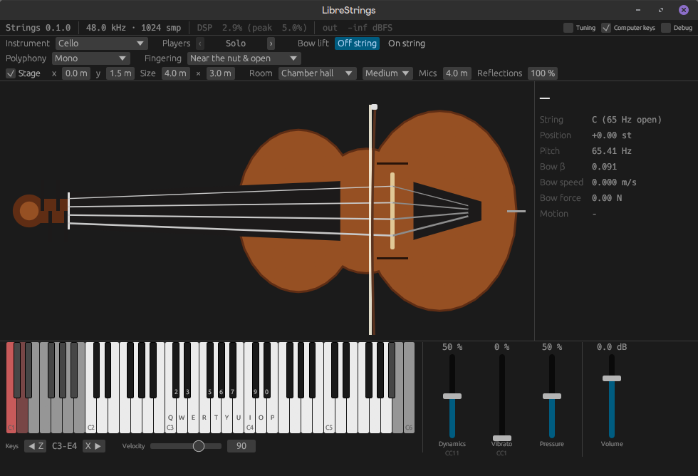

# LibreStrings

A free bowed-string synthesizer in Rust, built on physical modeling rather than samples. The sound comes from simulating a string and the stick-slip friction of a bow on it, sample by sample.



Disclaimer: Vibe-coded as an experiment with Claude. I honestly have no idea how it works, but it would be cool if anyone more skilled in DSP/Physical Modeling takes a look at it.

You can download the CLAP plugin for linux here: https://github.com/petterthowsen/librestrings/releases/latest

## How it works

- **String:** a digital waveguide. Velocity waves travel along delay lines between the bridge, the bow and the nut (or stopping finger). Loss and damping are lumped into the reflections; fractional delays keep the pitch within a cent.
- **Bow:** a friction junction at the bow point using a hyperbolic friction curve. It is solved in closed form every sample, so the cost per sample is fixed. The solver remembers whether the string was sticking or slipping, which it needs to choose correctly where more than one solution exists.
- **Playability:** the model reproduces the regimes of a real bowed string, as mapped by Schelleng's diagram:
  - clean **Helmholtz motion** at moderate bow force
  - a multi-slip "surface" sound when the force is too light
  - a raucous crunch when it is too heavy

  The controls are real physical quantities: bow force (N), bow speed (m/s) and bow position (a fraction of the string length from the bridge).

Section 3 of [PLAN.md](PLAN.md) has the equations and design decisions. [docs/](docs/) holds background research; the plan lists corrections to it.

## Building

You need a recent stable Rust toolchain (edition 2024).

The plugin's editor and the standalone app need system libraries for the window (X11/XCB, OpenGL) and audio (ALSA, JACK). On Debian or Ubuntu:

```sh
sudo apt install libasound2-dev libgl-dev libjack-jackd2-dev \
  libx11-xcb-dev libxcb1-dev libxcb-dri2-0-dev libxcb-icccm4-dev \
  libxcb-shape0-dev libxcb-xfixes0-dev libxcursor-dev libxkbcommon-dev
```

`strings-dsp` and `strings-render` build without them.

```sh
cargo build --release
cargo test
```

## Plugin

Build the CLAP bundle and install it to your CLAP folder (`~/.clap` on Linux, `~/Library/Audio/Plug-Ins/CLAP` on macOS, `%LOCALAPPDATA%\Programs\Common\CLAP` on Windows):

```sh
cargo xtask install
```

`cargo xtask bundle strings-plugin --release` only builds it, into `target/bundled/`.

The **Instrument** parameter picks the violin, viola, cello or double bass. Changing it builds the new instrument in the background and cuts off what was sounding.

It is a stereo instrument that takes MIDI:

| Input | Controls |
|---|---|
| Notes | Detached notes are new bow strokes; velocity sets the attack. Overlapping notes play legato; the landing note's velocity sets how fast it moves there (soft is a slow portamento) |
| CC11 | Dynamics: bow speed, force and position, and with them loudness |
| CC1 | Vibrato depth |
| C1, D1 | Keyswitches: bow lift off the string, on the string. They sit below the instrument: C1 and D1 on the cello, C0 and D0 on the bass, C2 and D2 on the viola, C3 and D3 on the violin |
| CC123, CC120 | All notes off (the bow ends gracefully), all sound off |

The bow lift decides how a note ends. Off the string, the bow lifts and the string rings on; short notes are thrown off, spiccato-like. On the string, the bow stops and rests there, so short notes are staccato (martelé when pressed hard).

Dynamics, vibrato, pressure (flautando to scratch), bow lift, polyphony (mono, double stops or divisi), fingering (near the nut, mid position, near the bridge) and volume are also plugin parameters that the host can automate. When a CC and a parameter both set a control, the one that changed last wins.

**Sections and the stage:**

- **Players** (1–12) sets the section size; 1 is a soloist. Each player has its own small differences in tuning, timing, vibrato, dynamics and bowing.
- With **Divisi** polyphony the players divide the notes of a chord among themselves, one note each, as desks of a section do; the notes already sounding stay where they are, so a note that comes in takes its players from the ones that have more than their share, and a note let go takes its players off. A soloist plays the chord as double stops, as without divisi; with more notes than players every player still plays one note, and a note that comes in with no player free takes the one whose note is closest to it in pitch.
- The section sits on a stage, heard through a pair of mics in front of it. **Stage x** and **Stage y** place its centre (metres: x to the audience's right, y back from the front of the stage), and **Section width** and **Section depth** set the area its players fill.
- **Room** (studio, chamber hall, concert hall, scoring stage), **Absorption**, **Mic distance** and **Reflections** shape the early reflections. There is no reverb tail; add your own. To place several instances in the same room, give them the same room settings.
- Turn **Stage** off for the players' dry, mono sum.

The editor shows the instrument, with the bow, finger and vibrating string following what the performer does, plus bow speed, bow force and whether the string is in clean Helmholtz motion. Below it are an on-screen keyboard and faders, so you can play without a MIDI controller:

- **Mouse:** click a key to play it. The lower you click on a key, the louder the note. Dragging across keys plays legato.
- **Computer keyboard:** `Q 2 W 3 E R 5 T 6 Y 7 U I 9 O 0 P` play C to E, in the tracker layout (the letter row plays the white keys, the number row the black keys). `Z` and `X` shift the octave. It works while the editor has keyboard focus; some hosts keep keys for their own shortcuts.
- **Debug** (top right) shows the force band, per-string data and the controls as the performer has them.

### Standalone app

To play without a DAW, run the plugin as a standalone app:

```sh
cargo run --release -p strings-plugin --features standalone -- --backend alsa
```

- `--backend` picks the audio: `alsa`, `jack`, or `dummy` (silent, for trying the editor). The default, `auto`, tries JACK, then ALSA, then falls back to `dummy`.
- With ALSA, pass `--output-device <name>` and `--midi-input <name>` to choose devices. Give an empty name (`--midi-input ""`) to list what's available.
- With JACK, the app connects to the running JACK server. Under PipeWire, start it through `pw-jack` (from the `pipewire-jack` package). `--connect-jack-midi-input <port>` connects a MIDI controller.
- `--sample-rate` (default 48000) and `--period-size` (default 512) set the ALSA buffer. A smaller period means lower latency.

Run with `--help` for all options.

## Offline renderer

`strings-render` drives the model offline and writes 32-bit float WAV files. `play` renders a whole instrument (or a section) through its body. The single-string commands below (`bow`, `pluck`, `schelleng`) write the raw force on the bridge in mono, peak-normalized to −1 dBFS; with no body, they sound thinner and buzzier than the real instrument. They use the violin strings unless you pass `--instrument viola`, `cello` or `bass`.

```sh
cargo run --release -p strings-render -- <command> [options]
# or, after building:
./target/release/strings-render <command> [options]
```

Add `--help` to any command for all options.

### `play`: an instrument or section from a score

```sh
strings-render play phrase -o out/phrase.wav     # cello; also: scale, legato, staccato, doublestops, divisi, ostinato, sul
strings-render play violin-phrase --instrument violin -o out/violin.wav   # also violin-scale, -legato, -staccato, -doublestops, -ostinato, -sul, -tasto
strings-render play viola-phrase --instrument viola -o out/viola.wav      # the same set, viola-*
strings-render play bass-phrase --instrument bass -o out/bass.wav         # the same set, bass-* (no tasto)
strings-render play phrase --players 8 -o out/section.wav                 # a section of 8 on the stage, stereo
strings-render play my.score -o out/my.wav       # a score file
```

A solo instrument renders dry, in mono; `--players N` (up to 12) or `--stage` renders in stereo from the stage. `--x`, `--y`, `--width`, `--depth`, `--room`, `--absorption`, `--mic-distance` and `--reflections` match the plugin's stage parameters.

The score format is described in `crates/strings-render/src/score.rs`; `crates/strings-render/scores/` has examples. `--bridge-out <file>` also writes the bridge force before the body; `--pressure`, `--fingering`, `--double-stops` and `--divisi` change how it is played. The strings run at twice the sample rate, which keeps high notes in tune; `--oversampling 1` runs them at the sample rate, for comparison.

### `bow`: bow a single note

The note has an attack, a sustain and an ending. `--end lift` lifts the bow and lets the string ring; `--end stop` stops the bow on the string.

```sh
# Open A string with default bowing
strings-render bow --string A -o out/a.wav

# D string stopped a fifth up, bowed fast and close to the bridge (sul ponticello)
strings-render bow --string D --semitones 7 --speed 0.3 --beta 0.05 -o out/d_pont.wav

# Too much force: the tone breaks into a raucous crunch
strings-render bow --string A --force 0.9 -o out/a_pressed.wav

# Also write per-sample internal signals as CSV
strings-render bow --string G --csv out/g.csv -o out/g.wav
```

| Option | Default | Meaning |
|---|---|---|
| `--instrument` | `violin` | `violin`, `viola`, `cello` or `bass` |
| `--string` | `A` | Open string: `G`, `D`, `A` or `E` on the violin, `C`, `G`, `D` or `A` on the viola and cello, `C`, `A`, `D` or `G` on the bass (its E string with a C extension, open C1) |
| `--semitones` | `0` | Stopped note, in semitones above the open string |
| `--force` | 0.3 × F_max | Bow force in newtons. The default sits inside the playable range |
| `--speed` | `0.1` | Bow speed in m/s |
| `--beta` | `0.1` | Bow position as a fraction of the string length, from the bridge (0.04–0.25 is sensible) |
| `--seconds` | `2` | Sustain length |
| `--attack`, `--release` | `0.08`, `0.15` | Ramp times in seconds |
| `--end` | `lift` | `lift` or `stop` |
| `--sample-rate` | `48000` | Any rate. Physical parameters are rate-independent |
| `--loss-lowpass` | preset | Overrides the string's high-frequency loss (0–1, higher is darker) |
| `--csv` | – | Writes `time, bridge_force, bow_point_velocity, friction_force, slipping` per sample |
| `-o`, `--out` | required | Output WAV path |

The renderer prints the force it used, along with Schelleng's theoretical force limits for that bow speed and position.

### `pluck`: a free string with no bow

Useful for checking tuning and decay by ear.

```sh
strings-render pluck --string E --semitones 12 -o out/e_pluck.wav
```

### `schelleng`: map where the bow produces a clean tone

This sweeps bow force against bow position and prints two maps side by side: what the simulation actually does, and what Schelleng's formulas predict.

```sh
strings-render schelleng --string G --speed 0.1
```

The symbols are `H` Helmholtz motion (a clean tone), `M` multi-slip (surface sound), `R` raucous and `.` no oscillation. This is the main tool for checking that a change to the bow or string still plays well.

## Project layout

```
crates/
  strings-dsp/      The model: waveguide string, bow friction, filters, presets.
                    Real-time safe (no allocation while processing), except the
                    offline `analysis` module used by tests and the renderer.
  strings-render/   Command-line offline renderer.
  strings-plugin/   The CLAP plugin and standalone app (nih-plug, egui editor).
xtask/              Bundles the plugin (`cargo xtask bundle`) and installs it (`cargo xtask install`).
docs/               Background research and reference material.
PLAN.md             Design, roadmap, caveats and alternatives.
```

The crates keep their working names (`strings-*`) for now.

## Contributing

It's early, and the design is still moving; [PLAN.md](PLAN.md) shows what's next. Before sending a change to the DSP, run `cargo test` and check `strings-render schelleng`. The physics tests guard tuning, stability and Helmholtz motion.

## License

LibreStrings is free software: you can redistribute it and/or modify it under the terms of the GNU General Public License as published by the Free Software Foundation, either version 3 of the License, or (at your option) any later version. See [LICENSE](LICENSE).

The papers in `docs/papers/` keep their own licenses, given in their file names.
